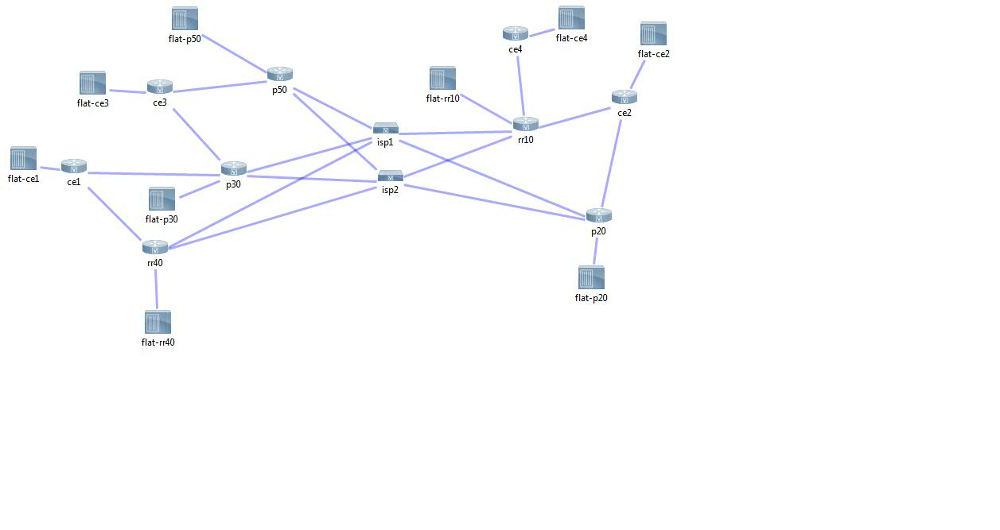

<b> Topology </b>

<b>Version-1: Data-Model</b>

This is a test data-model for a WAN deployment consisting of 5 PE WAN routers in an iBGP mesh, plus 4 CE WAN routers (CE1-4 above) connected to 1 or 2 PE routers.

The d-m is stored in four YAML files in the group_vars directory plus the includes directory

<b>includes/links.yml</b> contains the definition of the infrastructure links between the CE and PE routers

<b>group_vars/all.yml</b> contains a dictionary of the BGP ASN numbers assigned to each host

<b>group_vars/ce.yml</b> contains the information for setting up the loopbacks on each of the CE routers

<b>group_vars/pe.yml</b> contains information for setting up the VRF, OSPF, and BGP services used to create the iBGP mesh.

<b>templates.yml</b> is the ansible playbook which uses the "template" module to generate service and infrastucture config snippets for CE and PE routers and then assembles them together. The j2 templates used by the playbook are all stored in the templates directory.

<b>Adding Nodes</b>

To add a new CE router to the topology you will need to add the CE's assigned ASN to the dictionary in the all.yml file. You will need to assign it an unused index in the ce.yml file. For each PE it is attached to you will need to add an entry to the links.yml file describing both sides of the link. Once again you need to assign it an unused index number. You will also need to add it to the [ce] group in the "hosts" inventory file.

To add a new PE router to the topology you will need to add and entry to the dictionary in the all.yml file with the name of the new PE and the iBGP ASN. You will also need to add an entry into the pe.yml "g_pe_dict" dictionary. An entry is made of of a unique pe_index, bgp_role (currently an unused value), bgp_community_id, ospf_int1 (this is the interface connecting the ISP1), and ospf_int1_descr holding the circuit info for that link. You will also need to add it to the [pe] group in the "hosts" inventory file.

<b>Version-2: Changing Network State</b>

Generate the configuration using the data-model from the previous assignment (templates slightly modified and cleaned up since ver-1)

Can successfully push the configuration to all the WAN nodes using the ios_config module. Found a behavioral difference between module behavior in 2.4 and 2.5. Seems to be a bug in 2.5 where "show run all" is used for comparison regardless of how you set the "defaults" attribute. I applied a workaround, but if they ever fix the bug the workaround of using the "show run all" version of the 'ospf neighbor' settings will be reverted and likely break the playbook until I revert to the "show run" version of the line in the template.

Validate by verifying OSPF and BGP neighborships. I do this by parsing the "show" commands into data-structures and looping through them looking for any that aren't "up". Real-world validation will likely be more comprehensive (inspecting routing tables, etc) than this, but the final design has not been completed and it is not fully operational in the lab as I was working on this project.

Three playbooks: generate_templates.yml, push_config.yml, validate_pe_routing.yml

